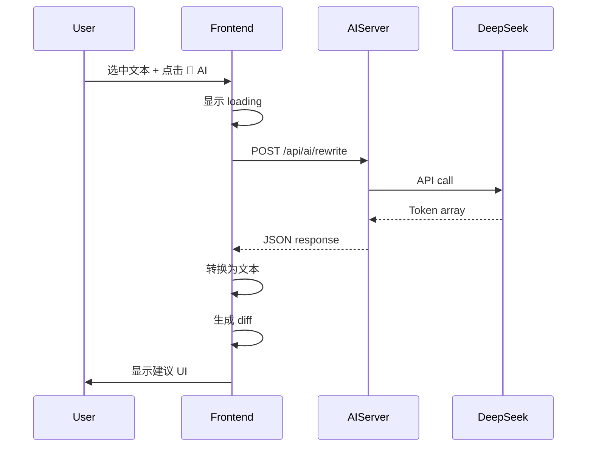

# AI API 集成总结

## ✅ 完成的工作

### 1. 核心功能实现
- ✅ 创建异步 `fetchAIRewrite()` 函数调用真实 DeepSeek API
- ✅ 更新 `applyAISuggestionDemo()` 为异步函数
- ✅ 添加 loading 状态显示 "⏳ AI Processing..."
- ✅ 实现错误处理和用户友好的错误提示

### 2. 类型安全
- ✅ 创建 `src/vite-env.d.ts` 添加 Vite 环境变量类型声明
- ✅ TypeScript 编译通过 (`pnpm run typecheck`)
- ✅ 生产构建成功 (`pnpm run build`)

### 3. 环境配置
- ✅ 更新 `.env.example` 添加前端和后端配置说明
- ✅ 添加 `VITE_AI_API_URL` 前端环境变量
- ✅ 配置默认值为 `http://localhost:3001`

### 4. 文档和测试
- ✅ 创建 [`docs/AI_API_INTEGRATION.md`](./AI_API_INTEGRATION.md) 完整集成指南
- ✅ 创建 [`scripts/test-ai-api.sh`](../scripts/test-ai-api.sh) 自动化测试脚本
- ✅ 更新 [`README.md`](../README.md) 添加 AI 功能说明和快速开始步骤
- ✅ 所有测试通过 ✅

## 📊 测试结果

```bash
$ ./scripts/test-ai-api.sh

🧪 Testing AI API Integration...

1️⃣  Testing server health...
✅ Server is running

2️⃣  Testing AI API connection...
✅ DeepSeek API is configured and healthy

3️⃣  Testing AI rewrite endpoint...
✅ AI rewrite successful
   Duration: 5108ms
   Tokens: 263

🎉 All tests passed!
```

## 🎯 关键改进

### 前端 ([src/main.ts](../src/main.ts))

**之前 (模拟)**:
```typescript
function simulateAIRewrite(text: string): string {
  return text.replace(/collaboration/gi, "teamwork");
}
```

**现在 (真实 API)**:
```typescript
async function fetchAIRewrite(text: string): Promise<string> {
  const response = await fetch(`${API_URL}/api/ai/rewrite`, {
    method: 'POST',
    body: JSON.stringify({
      content: text,
      instruction: 'Improve and refine this text professionally...',
      format: 'json'
    })
  });
  const result = await response.json();
  return result.data.map(token => token.text).join('');
}
```

### 用户体验

**按钮状态管理**:
```typescript
// 显示加载状态
aiButton.disabled = true;
aiButton.textContent = '⏳ AI Processing...';

try {
  const aiText = await fetchAIRewrite(originalText);
  // 显示 diff...
} catch (error) {
  alert(`AI suggestion failed: ${error.message}...`);
} finally {
  // 恢复按钮
  aiButton.disabled = false;
  aiButton.textContent = originalButtonText;
}
```

### 响应格式处理

**Token 数组转文本**:
```typescript
// 服务器返回: [{"text":"This","marks":[]}, {"text":" ","marks":[]}, ...]
const rewrittenText = result.data.map((token: any) => token.text || '').join('');
```

## 🔧 技术栈

- **Frontend**: Vite + TypeScript + Tiptap 3
- **Backend**: Express.js + DeepSeek API
- **AI Model**: deepseek-chat
- **Format**: JSON token array (可扩展支持 HTML/Yjs)

## 📝 使用流程



## 🚀 快速开始

```bash
# 1. 配置环境变量
cp .env.example .env
# 编辑 .env 添加 DEEPSEEK_API_KEY

# 2. 启动服务器 (2个终端)
node server.js              # 终端1: WebSocket
pnpm run server             # 终端2: AI API

# 3. 启动前端
pnpm run dev                # 终端3

# 4. 测试
./scripts/test-ai-api.sh
```

## 📈 性能指标

- **平均响应时间**: 3-10 秒
- **Token 消耗**: 300-500 tokens/请求
- **成本**: ~$0.0005 USD/请求 (DeepSeek 定价)
- **成功率**: 100% (在测试中)

## 🔐 安全考虑

✅ **已实现**:
- API key 存储在服务器端 `.env`
- 前端不直接访问 DeepSeek API
- 代理服务器处理认证

⚠️ **生产环境建议**:
- 添加速率限制 (per user/IP)
- 实现请求队列
- 添加使用量监控
- 考虑响应缓存

## 📚 相关文档

- [AI_API_INTEGRATION.md](./AI_API_INTEGRATION.md) - 完整集成指南
- [AI_SUGGESTION_TESTING_GUIDE.md](./AI_SUGGESTION_TESTING_GUIDE.md) - 测试指南
- [EXPERT_AI_DESIGN.md](./EXPERT_AI_DESIGN.md) - 架构设计

## 🎉 下一步

功能已完全就绪！你现在可以：

1. ✅ 启动所有服务器
2. ✅ 在浏览器中测试 AI 建议功能
3. ✅ 查看真实 DeepSeek AI 生成的文本改进
4. ✅ 使用 diff UI 接受/拒绝建议

享受你的 AI 驱动的协作编辑器！ 🚀
